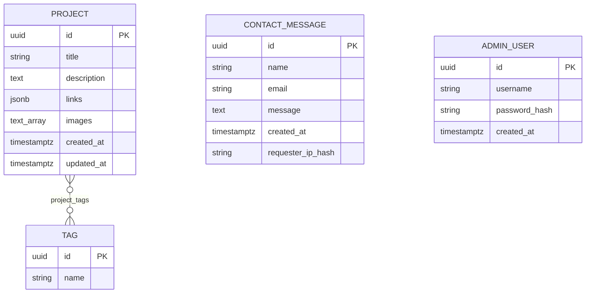
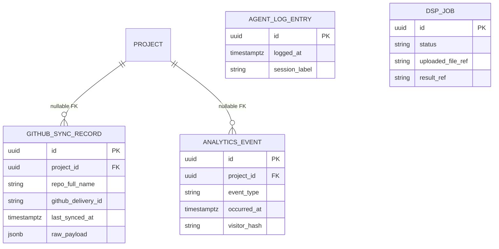

# Data Model

Draft the ER diagram and entity definitions here before writing migrations or JPA entities.

## Conventions (locked 2026-07-24, see `docs/DECISIONS.md`)

- **Primary keys:** `uuid` on every table (app- or DB-generated `gen_random_uuid()` / `uuid_generate_v4()`). Avoids sequential-ID enumeration on public API URLs; consistent with the original ER diagram draft.
- **Timestamps:** `timestamptz`, defaulting to `now()` where the field marks creation time.
- **Images:** plain array of external URL strings — no upload endpoint or storage backend. Admin pastes a link (GitHub raw, image host, etc.).
- **Links:** `jsonb` array of `{label, url}` objects (e.g. `[{"label":"GitHub","url":"..."},{"label":"Live demo","url":"..."}]`) — supports multiple labeled links per project without a join table.

## Core entities

### Project

| Field | Type | Notes |
|---|---|---|
| id | uuid, PK | |
| title | varchar(200), not null | |
| description | text, not null | |
| links | jsonb, not null default `[]` | array of `{label, url}` — see Conventions above |
| images | text[], not null default `{}` | array of external image URLs |
| created_at | timestamptz, not null default `now()` | |
| updated_at | timestamptz, not null default `now()` | bump on every update |

Relationships: many-to-many with `Tag` via join table `project_tags` (`project_id` FK, `tag_id` FK, composite PK, `ON DELETE CASCADE` both sides). Needs pagination/filtering support from the start (Phase 2 — retrofitting later, once real data and a frontend depend on the shape, is the thing to avoid).

### Tag

| Field | Type | Notes |
|---|---|---|
| id | uuid, PK | |
| name | varchar(50), not null, unique | case-insensitive uniqueness (`citext` or a lowercased unique index) to avoid `"React"` / `"react"` duplicates |

Relationships: many-to-many with `Project` via `project_tags` (see above).

### ~~BlogPost / Writeup~~ — cut from scope (2026-07-21)

Was floated in the original data-model draft; confirmed out of scope in `SPEC.md` → Explicit non-goals. Left here only for traceability — don't implement.

### ContactMessage

| Field | Type | Notes |
|---|---|---|
| id | uuid, PK | |
| name | varchar(200), not null | |
| email | varchar(320), not null | max length per RFC 5321; validate format at the DTO layer, not here |
| message | text, not null | |
| created_at | timestamptz, not null default `now()` | |
| requester_ip_hash | varchar(64), not null | sha-256 hex digest of requester IP, never the raw IP — same privacy stance as `AnalyticsEvent.visitor_hash` below |

Rate limiting: no separate table — query `count(*) where requester_ip_hash = ? and created_at > now() - interval` at request time. Revisit only if this endpoint sees enough volume for that query to matter.

### AdminUser

_Confirmed in scope — see SPEC.md → Auth scope decision._

| Field | Type | Notes |
|---|---|---|
| id | uuid, PK | |
| username | varchar(100), not null, unique | |
| password_hash | varchar(255), not null | bcrypt or argon2 — never store plaintext or use a reversible hash |
| created_at | timestamptz, not null default `now()` | |

---

## Phase 7 extension entities

**These are inferred from the Phase 7 feature descriptions in `PROJECT_TODO.md` — the TODO does not specify exact fields. Treat every table below as a draft to confirm or rewrite before implementing, not a settled schema.**

### GithubSyncRecord (7a — GitHub webhook auto-sync)

Tracks synced repo metadata and links it back to a `Project`. Needs to support idempotency (same webhook delivery arriving twice shouldn't duplicate data).

| Field | Type | Notes |
|---|---|---|
| id | uuid, PK | |
| project_id | uuid, FK → Project, nullable | nullable until matched/created |
| repo_full_name | varchar(255), not null | e.g. `user/repo` |
| github_delivery_id | varchar(255), not null, unique | GitHub's `X-GitHub-Delivery` header — unique constraint is the idempotency check on webhook redelivery |
| last_synced_at | timestamptz | |
| raw_payload | jsonb, nullable | optional, for debugging sync issues |

### AgentLogEntry (7b — rendered agent build-log page)

TODO floats two options: parse `AGENT_LOG.md` directly, or move entries into the DB ("arguably cleaner"). If DB-backed, mirror the `AGENT_LOG.md` entry format:

| Field | Type | Notes |
|---|---|---|
| id | uuid, PK | |
| logged_at | timestamptz, not null | |
| session_label | varchar(255) | |
| task_given | text | |
| agents_used | text[] | e.g. `{backend-agent, frontend-agent}` |
| what_went_wrong | text | |
| how_it_was_caught | text | |
| fix_applied | text | |
| takeaway | text | |

### AnalyticsEvent (7c — custom analytics)

Privacy constraint from the TODO: no fingerprinting, no third-party trackers, IPs hashed or not stored at all.

| Field | Type | Notes |
|---|---|---|
| id | uuid, PK | |
| project_id | uuid, FK → Project, nullable | null for site-wide events |
| event_type | varchar(50), not null | e.g. `page_view`, `project_click` |
| occurred_at | timestamptz, not null default `now()` | |
| visitor_hash | varchar(64), not null | sha-256 of IP + daily-rotating salt (not raw IP) — dedup/rate-limiting only, not cross-session tracking |

### DspJob (7d — live DSP/audio demo)

Async job record: build this last, on the `@Async` executor provisioned in Phase 1. Needs strict file size/type limits and a queue, results delivered via polling or WebSocket (not a blocking request).

| Field | Type | Notes |
|---|---|---|
| id | uuid, PK | |
| status | varchar(20), not null | `queued` / `processing` / `done` / `failed` |
| uploaded_file_ref | varchar(500), not null | path/blob reference, with size/type limits enforced before storing |
| result_ref | varchar(500), nullable | |
| created_at | timestamptz, not null default `now()` | |
| completed_at | timestamptz, nullable | |

---

## ER diagram

Core entities (confirmed scope) — `ContactMessage` and `AdminUser` have no FK relationships to `Project`/`Tag`, shown standalone:

Phase 7 draft entities (speculative — see caveat above each table) relate back to `PROJECT` as follows; not implemented until each sub-phase starts:

(`AgentLogEntry` and `DspJob` have no FK relationship to `Project`, so they're listed but not connected above.)

## Migration notes

- First migration: `V1__init.sql` (Flyway) — should create `project`, `tag`, `project_tags`, `contact_message`, `admin_user`. Phase 7 tables land in their own later migrations, one per sub-phase, not upfront.
- Record schema changes here as they land, or link to migration files directly.
