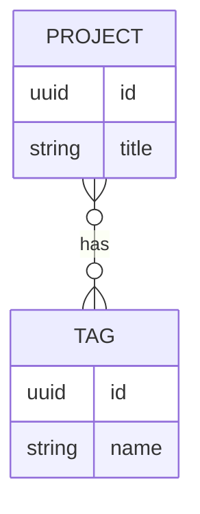

# Data Model

Draft the ER diagram and entity definitions here before writing migrations or JPA entities.

## Entities

### Project

| Field | Type | Notes |
|---|---|---|
| id | | |
| title | | |
| description | | |
| links | | e.g. GitHub, live demo |
| images | | |
| created_at / updated_at | | |

Relationships: many-to-many with `Tag`.

### Tag

| Field | Type | Notes |
|---|---|---|
| id | | |
| name | | |

Relationships: many-to-many with `Project`.

### BlogPost / Writeup

_Fill in if in scope (see SPEC.md)._

| Field | Type | Notes |
|---|---|---|
| id | | |
| title | | |
| body | | |
| published_at | | |

### ContactMessage

| Field | Type | Notes |
|---|---|---|
| id | | |
| name | | |
| email | | |
| message | | |
| created_at | | |
| (rate-limit metadata) | | e.g. IP/hash, timestamp |

### AdminUser

_Only if auth is in scope — see SPEC.md → Auth scope decision._

| Field | Type | Notes |
|---|---|---|
| id | | |
| username | | |
| password_hash | | |

## ER diagram

Paste a Mermaid diagram or link an image once the fields above are settled:

## Migration notes

- First migration: `V1__init.sql` (Flyway)
- Record schema changes here as they land, or link to migration files directly.
