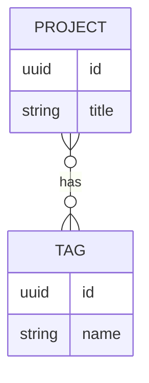

# Data Model

Draft the ER diagram and entity definitions here before writing migrations or JPA entities.

## Core entities

### Project

| Field | Type | Notes |
|---|---|---|
| id | | |
| title | | |
| description | | |
| links | | e.g. GitHub, live demo |
| images | | |
| created_at / updated_at | | |

Relationships: many-to-many with `Tag`. Needs pagination/filtering support from the start (Phase 2 — retrofitting later, once real data and a frontend depend on the shape, is the thing to avoid).

### Tag

| Field | Type | Notes |
|---|---|---|
| id | | |
| name | | |

Relationships: many-to-many with `Project`.

### ~~BlogPost / Writeup~~ — cut from scope (2026-07-21)

Was floated in the original data-model draft; confirmed out of scope in `SPEC.md` → Explicit non-goals. Left here only for traceability — don't implement.

### ContactMessage

| Field | Type | Notes |
|---|---|---|
| id | | |
| name | | |
| email | | |
| message | | |
| created_at | | |
| (rate-limit metadata) | | e.g. IP/hash, timestamp |

### AdminUser

_Confirmed in scope — see SPEC.md → Auth scope decision._

| Field | Type | Notes |
|---|---|---|
| id | | |
| username | | |
| password_hash | | |

---

## Phase 7 extension entities

**These are inferred from the Phase 7 feature descriptions in `PROJECT_TODO.md` — the TODO does not specify exact fields. Treat every table below as a draft to confirm or rewrite before implementing, not a settled schema.**

### GithubSyncRecord (7a — GitHub webhook auto-sync)

Tracks synced repo metadata and links it back to a `Project`. Needs to support idempotency (same webhook delivery arriving twice shouldn't duplicate data).

| Field | Type | Notes |
|---|---|---|
| id | | |
| project_id | FK → Project | nullable until matched/created |
| repo_full_name | | e.g. `user/repo` |
| github_delivery_id | | for idempotency checks on webhook redelivery |
| last_synced_at | | |
| raw_payload | | optional, for debugging sync issues |

### AgentLogEntry (7b — rendered agent build-log page)

TODO floats two options: parse `AGENT_LOG.md` directly, or move entries into the DB ("arguably cleaner"). If DB-backed, mirror the `AGENT_LOG.md` entry format:

| Field | Type | Notes |
|---|---|---|
| id | | |
| logged_at | | |
| session_label | | |
| task_given | | |
| agents_used | | |
| what_went_wrong | | |
| how_it_was_caught | | |
| fix_applied | | |
| takeaway | | |

### AnalyticsEvent (7c — custom analytics)

Privacy constraint from the TODO: no fingerprinting, no third-party trackers, IPs hashed or not stored at all.

| Field | Type | Notes |
|---|---|---|
| id | | |
| project_id | FK → Project, nullable | null for site-wide events |
| event_type | | e.g. `page_view`, `project_click` |
| occurred_at | | |
| visitor_hash | | hashed, not raw IP — for dedup/rate-limiting only |

### DspJob (7d — live DSP/audio demo)

Async job record: build this last, on the `@Async` executor provisioned in Phase 1. Needs strict file size/type limits and a queue, results delivered via polling or WebSocket (not a blocking request).

| Field | Type | Notes |
|---|---|---|
| id | | |
| status | | `queued` / `processing` / `done` / `failed` |
| uploaded_file_ref | | path/blob reference, with size/type limits enforced before storing |
| result_ref | | |
| created_at / completed_at | | |

---

## ER diagram

Paste a Mermaid diagram or link an image once the fields above are settled. Core entities only, shown here as a starting point:

## Migration notes

- First migration: `V1__init.sql` (Flyway)
- Record schema changes here as they land, or link to migration files directly.
